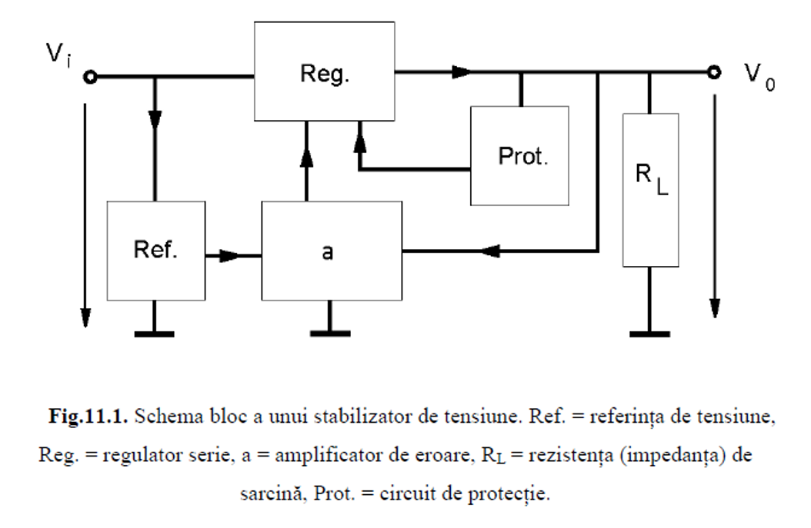
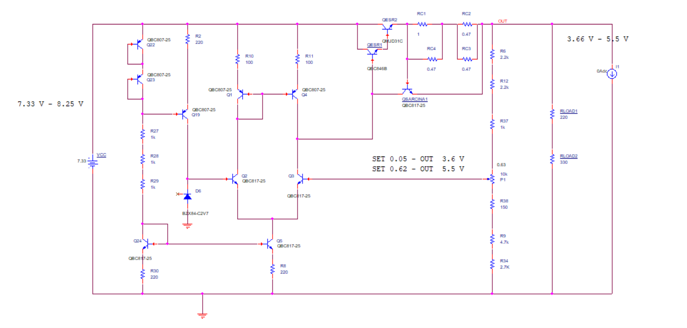
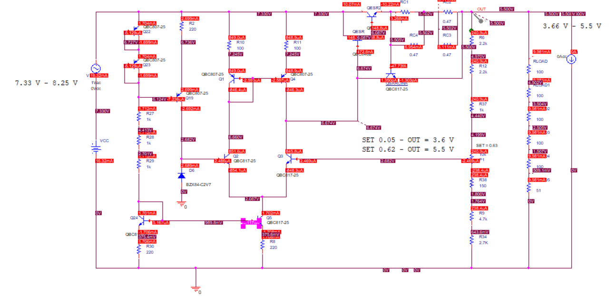
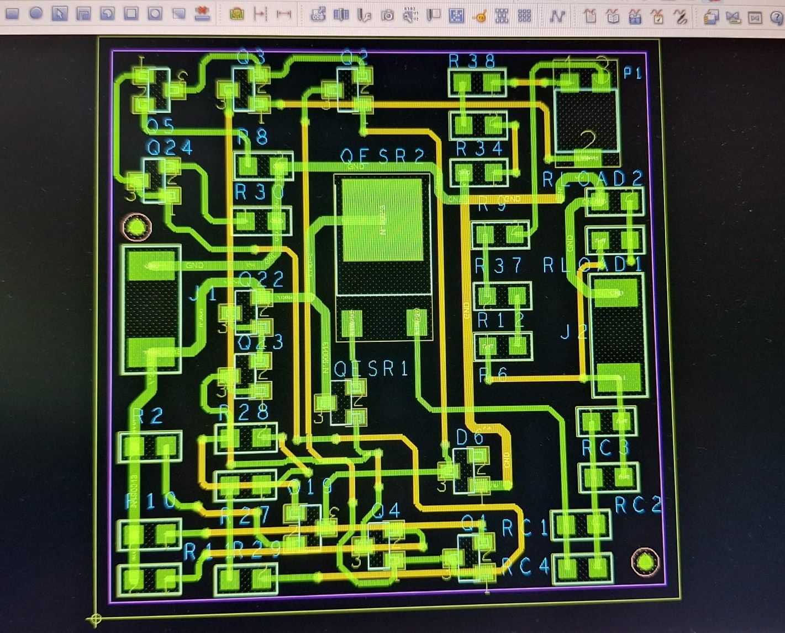

# Stabilizator de tensiune cu Element de Reglaj Serie (SERS)

## Descriere
Acest proiect prezintă proiectarea, simularea și analiza unui stabilizator liniar cu element de reglaj serie.  
Proiectul a fost realizat în cadrul **Universitatea Politehnica din București, Facultatea de Electronică, Telecomunicații și Tehnologia Informației**.

## Principiu de funcționare
Stabilizatorul menține constantă tensiunea pe sarcină printr-un proces de reglare automată:
- O fracțiune din tensiunea de ieșire este comparată cu o tensiune de referință stabilă (diodă Zener + sursă de curent constant).
- Semnalul de eroare este amplificat și comandă elementul regulator serie (tranzistoare în conexiune Darlington).
- Include protecție la supracurent pentru a limita curentul maxim la 0,4 A.

## Cerințe de proiectare 
Să se proiecteze si realizeze un stabilizator de tensiune cu ERS având următoarele caracteristici: 
- Tensiunea de ieșire reglabilă în intervalul: N/3 – N/2 = 3.66 – 5.5[V];
- Element de reglaj serie;
- Sarcina la ieșire 50N = 550 [ohm];
- Deriva termică < 2 mV/C;
- Protecție la suprasarcină prin limitarea curentului tranzistorului element de reglaj serie la maxim 0,4 A;
- Tensiune de intrare în intervalul 2/3N - 3/4N = 7.33 – 8.25[V];
- Domeniul temperaturilor de funcționare: 0-70 C (verificabil prin testare în temperatură);
- Amplificarea în tensiune minimă (în buclă deschisă) a amplificatorului de eroare: 200; 

## Schema bloc

## Schema electrică 

## Punctul static de funcționare

---

## Proiectare Hardware (PCB)

Proiectul a fost realizat în tehnologie **SMT (Surface Mount Technology)** pe un cablaj dublu strat, respectând constrângerile de spațiu și specificațiile din tema de proiectare.

### Caracteristici Tehnice Cablaj:
* **Dimensiuni placă:** 40mm x 40mm
* **Material:** FR4 (dublu strat)
* **Grosime placă:** 1.5 mm
* **Grosime folie cupru:** 18 $\mu m$

### Layout PCB (Previzualizare)
Mai jos este prezentată captura de ecran cu layout-ul PCB-ului realizat în **OrCAD Allegro PCB Editor**.

> **Notă:** Traseele de pe stratul TOP sunt evidențiate cu roșu/galben, iar cele de pe stratul BOTTOM cu verde (în funcție de vizualizarea din editorul CAD).

---

## Autor
Tănăselea Neculai
